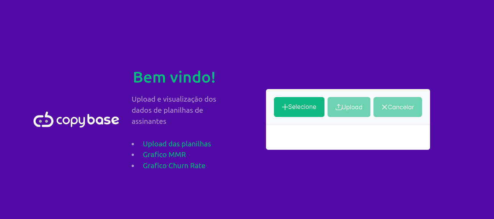
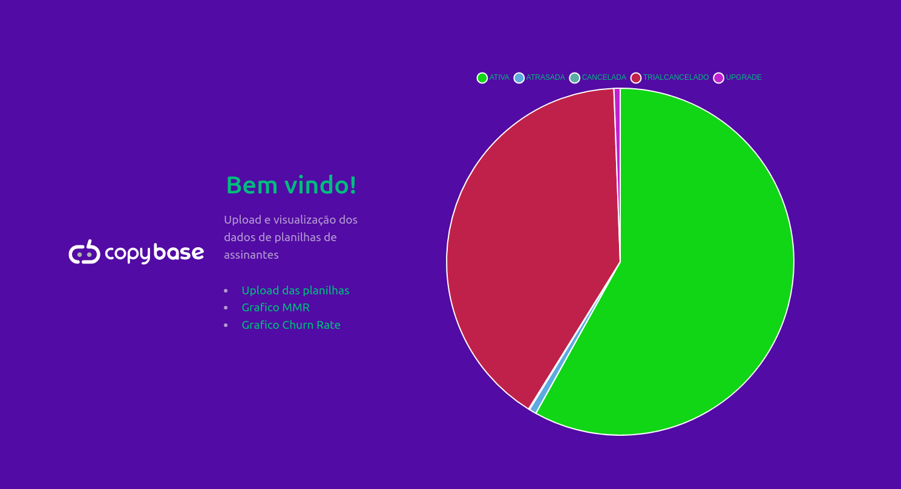
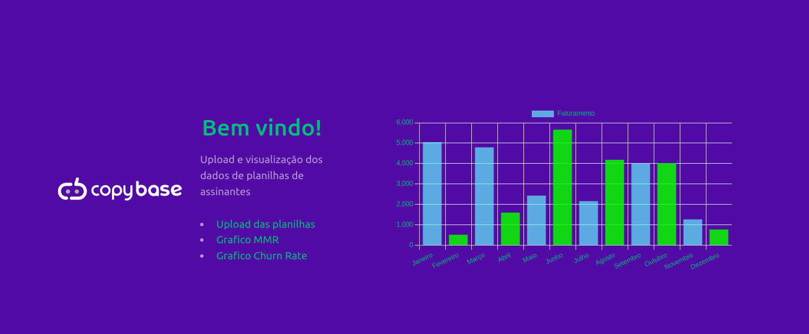

# Desafio Copy Base


## 💻 Pré-requisitos

Antes de começar, verifique se você atendeu aos seguintes requisitos:

- Possuir o Docker instalado em seu ambiente para rodar o desafio.

## 🚀 Instalando 

Para instalar o [Desafio Copybase](https://github.com/Kamifaria/copybase-desafio), siga estas etapas:

Linux Windows ou macOS:

```
git clone https://github.com/Kamifaria/copybase-desafio
cd copybase-desafio
docker-compose up -d
```

## ☕ Usando Desafio Copybase

Para usar Desafio Copybase, siga estas etapas:

#Carregue a planilha ao fazer o upload

<p align="center"></a></p>

#Visualize o gráfico de Churn rate

<p align="center"></a></p>

#Visualize o gráfico de MMR

<p align="center"></a></p>

## 👩‍💻 Colaboradora:

<table>
  <tr>
    <td align="center">
      <a href="#" title="defina o titulo do link">
        <br>
        <sub>
          <b>Kamila de Paula Faria Afonso</b>
        </sub>
      </a>
    </td>
  </tr>
</table>
